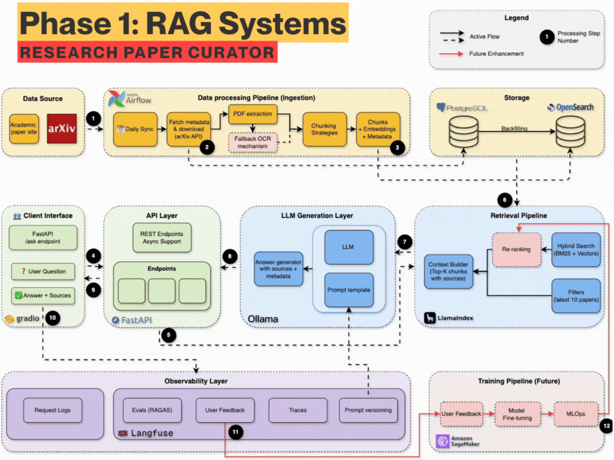

# Production ready RAG system
Learn to build modern AI systems production grade from the ground up through hands-on implementation

<p align="center">
  
  
  
  
  
</p>

</br>

<p align="center">
  <a href="#-about-this-course">
    
  </a>
</p>


## 🏗️ System Architecture Evolution

### Agentic RAG
<div align="center">
  
  <p><em>The agentic RAG system: guardrails, retrieval grading, and query rewriting</em></p>
</div>


## 📖 Deep Dives

| Document | What it covers |
|----------|----------------|
| **[Anatomy of a Production-Grade Agentic RAG System](docs/ARTICLE.md)** | Long-form article on what production readiness actually costs: ingestion, chunking, hybrid retrieval + reranking, agent orchestration, fault tolerance, semantic caching, and the evaluation loop. Diagrams throughout, plus an honest list of what isn't production-ready yet. |
| [Senior Engineer Onboarding Guide](docs/onboarding.md) | Setup, service access, project layout, and troubleshooting. |
| [How OpenSearch Powers Retrieval](docs/opensearch-search.md) | Deep dive on the search layer: index mapping, BM25 query construction, kNN, and RRF fusion. |

**Start here** if you want to understand *why* the system is built this way before reading the code.


## 🚀 Quick Start

### **📋 Prerequisites**
- **Docker Desktop** (with Docker Compose)  
- **Python 3.12+**
- **UV Package Manager** ([Install Guide](https://docs.astral.sh/uv/getting-started/installation/))
- **8GB+ RAM** and **20GB+ free disk space**

### **⚡ Get Started**

```bash
# 1. Clone and setup
git clone <repository-url>
cd arxiv-paper-curator

# 2. Configure environment (IMPORTANT!)
cp .env.example .env
# The .env file contains all necessary configuration for OpenSearch, 
# arXiv API, and service connections. Defaults work out of the box.
# You need to add Jina embeddings free api key and langfuse keys (check the blogs)

# 3. Install dependencies
uv sync

# 4. Start all services
docker compose up --build -d

# 5. Verify everything works
curl http://localhost:8000/api/v1/health
```


## ⚙️ Configuration

**Setup:**
```bash
cp .env.example .env
# Edit .env for your environment
```

**Key Variables:**
- `JINA_API_KEY` - Required for hybrid search embeddings and reranking
- `LANGFUSE__PUBLIC_KEY` & `LANGFUSE__SECRET_KEY` - Optional, enables Langfuse Cloud tracing at https://cloud.langfuse.com

**Complete Configuration:** See [.env.example](.env.example) for all available options and detailed documentation.

---

## 🔧 Reference & Development Guide

### **🛠️ Technology Stack**

| Service | Purpose | Status |
|---------|---------|--------|
| **FastAPI** | REST API with automatic docs | ✅ Ready |
| **PostgreSQL 16** | Paper metadata and content storage | ✅ Ready |
| **OpenSearch 2.19** | Hybrid search engine (BM25 + Vector) | ✅ Ready |
| **Apache Airflow 3.0** | Workflow automation | ✅ Ready |
| **Jina AI** | Embedding generation and reranking | ✅ Ready |
| **Ollama** | Local LLM serving | ✅ Ready |
| **Bifrost** | LLM gateway with provider fallback | ✅ Ready |
| **Redis Stack** | Exact and semantic response caching | ✅ Ready |
| **Langfuse** | RAG pipeline observability via Langfuse Cloud | ✅ Ready |
| **RAG Evals** | LLM-as-judge scoring of Langfuse traces | ✅ Ready |

**Development Tools:** UV, Ruff, MyPy, Pytest, Docker Compose

### **🏗️ Project Structure**

```
arxiv-paper-curator/
├── src/                    # Main application code
│   ├── api/            # API endpoints (search, ask, papers)
│   ├── domain/           # Business logic (opensearch, ollama, agents, cache)
│   ├── models/             # Database models (SQLAlchemy)
│   ├── schemas/            # Pydantic validation schemas
│   └── config.py           # Environment configuration
├── evals/                  # Standalone Langfuse trace evaluation (own pyproject.toml)
├── docs/                   # Architecture deep dives and onboarding guide
├── airflow/                # Workflow orchestration (DAGs)
├── tests/                  # Test suite
└── compose.yml             # Docker service orchestration
```

### **📡 API Endpoints Reference**

| Endpoint | Method | Description |
|----------|--------|-------------|
| `/api/v1/health` | GET | Service health check |
| `/api/v1/hybrid-search/` | POST | BM25, vector, or hybrid search over chunks |
| `/api/v1/ask` | POST | Standard RAG question answering |
| `/api/v1/stream` | POST | Streaming RAG responses (SSE) |
| `/api/v1/ask-agentic` | POST | Agentic RAG with guardrail, grading, and query rewrite |
| `/api/v1/ask-sql` | POST | Text-to-SQL agent over PostgreSQL |
| `/api/v1/ask-router` | POST | Knowledge router across retrieval agents |
| `/api/v1/feedback` | POST | Submit user feedback against a Langfuse trace |

**API Documentation:** Visit http://localhost:8000/docs for interactive API explorer

### **🔧 Essential Commands**

#### **Using the Makefile** (Recommended)
```bash
# View all available commands
make help

# Quick workflow
make start         # Start all services
make health        # Check all services health
make test          # Run tests
make stop          # Stop services
```

#### **All Available Commands**
| Command | Description |
|---------|-------------|
| `make start` | Start all services |
| `make stop` | Stop all services |
| `make restart` | Restart all services |
| `make status` | Show service status |
| `make logs` | Show service logs |
| `make health` | Check all services health |
| `make setup` | Install Python dependencies |
| `make format` | Format code |
| `make lint` | Lint and type check |
| `make test` | Run tests |
| `make test-cov` | Run tests with coverage |
| `make clean` | Clean up everything |

#### **Evals Commands** (run from `evals/` directory)
| Command | Description |
|---------|-------------|
| `make setup` | Install evals dependencies (`uv sync`) |
| `make eval-quick` | Score traces with default settings |
| `make eval` | Interactive evaluation mode |
| `make eval-no-report` | Run without writing a JSON report |

#### **Direct Commands** (Alternative)
```bash
# If you prefer using commands directly
docker compose up --build -d    # Start services
docker compose ps               # Check status
docker compose logs            # View logs
uv run pytest                 # Run tests
```

### **🎓 Target Audience**
| Who | Why |
|-----|-----|
| **AI/ML Engineers** | Learn production RAG architecture beyond tutorials |
| **Software Engineers** | Build end-to-end AI applications with best practices |
| **Data Scientists** | Implement production AI systems using modern tools |

---

## 🛠️ Troubleshooting

**Common Issues:**
- **Services not starting?** Wait 2-3 minutes, check `docker compose logs`
- **Port conflicts?** Stop other services using ports 8000, 8080, 5412, 9200
- **Memory issues?** Increase Docker Desktop memory allocation

**Get Help:**
- Check the troubleshooting table in the [onboarding guide](docs/onboarding.md)
- Review service logs: `docker compose logs [service-name]`
- Complete reset: `docker compose down --volumes && docker compose up --build -d`

---

## 💰 Cost Structure

**This course is completely free!** You'll only need minimal costs for optional services:
- **Local Development:** $0 (everything runs locally)
- **Optional Cloud APIs:** ~$2-5 for external LLM services (if chosen)

---

<div align="center">
  <h3>🎉 Ready to Start Your AI Engineering Journey?</h3>
  <p><strong>Start with the <a href="docs/ARTICLE.md">architecture deep dive</a>, then run the stack and explore the code.</strong></p>
  
  <p><em>For learners who want to master modern AI engineering</em></p>
  <p><strong>Built with love by <a href="https://www.linkedin.com/in/shirin-khosravi-jam/">Shirin Khosravi Jam</a> & <a href="https://www.linkedin.com/in/shantanuladhwe/">Shantanu Ladhwe</a></strong></p>
</div>

---

## TODOs
- [ ] Use virtual keys for bifrost
- [ ] Add governance with bifrost plugins


## 📄 License

MIT License - see [LICENSE](LICENSE) file for details.


