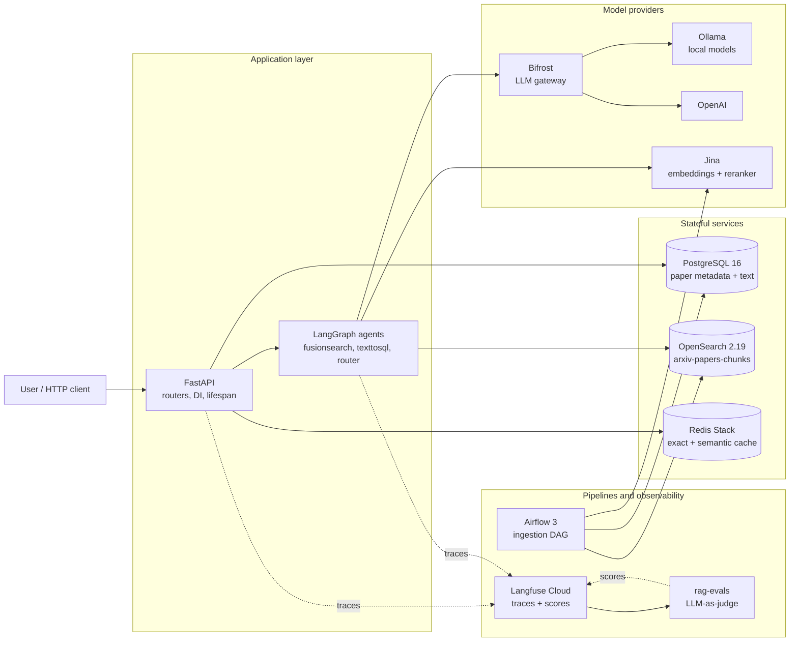
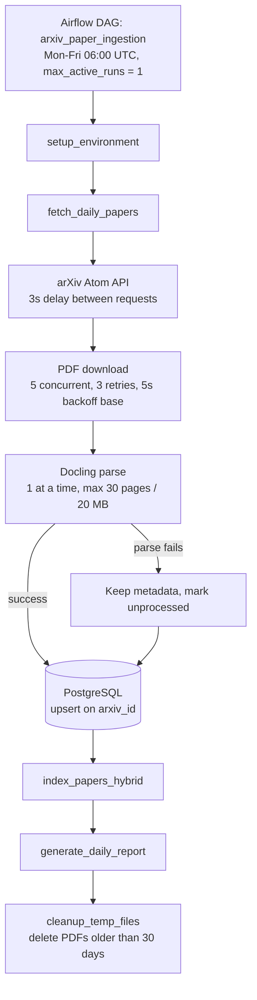
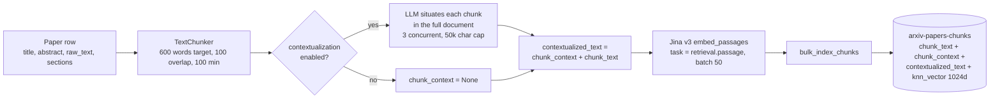
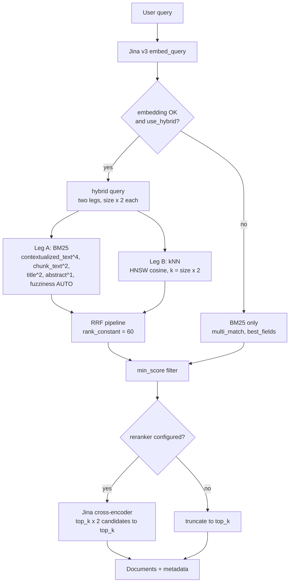
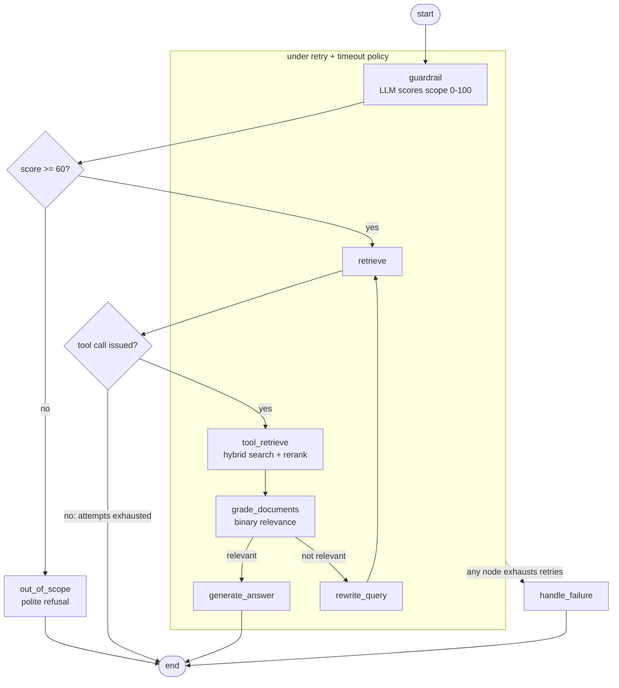
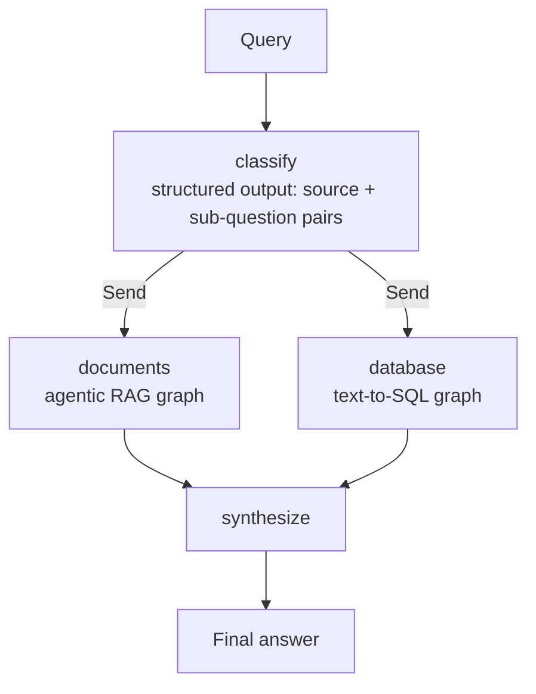
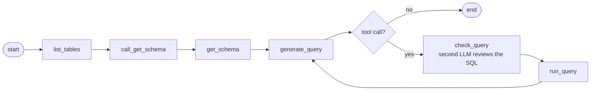
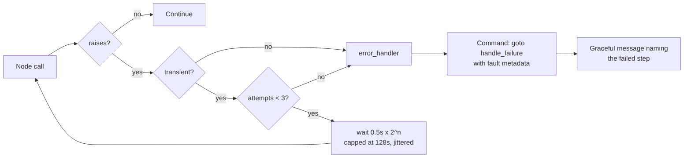
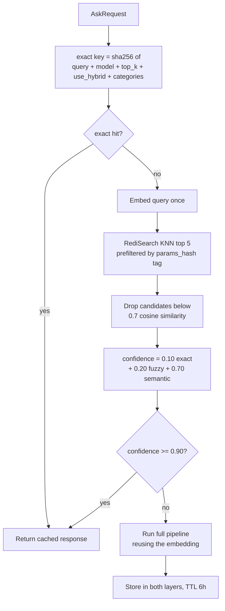
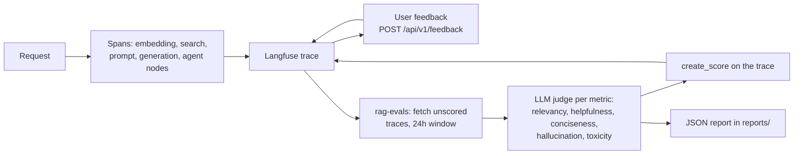

# Anatomy of a production-grade agentic RAG system

Most RAG tutorials end where the interesting work starts. You load documents, split them on a fixed character count, push vectors into a store, stuff the top 5 results into a prompt, and get an answer. It demos beautifully. Then you put it in front of users and find out how much of your traffic is off-topic, how many questions are near-duplicates of something you answered ten minutes ago, what happens when your embedding provider returns a 502 during the morning peak, and that nobody can tell you whether last week's prompt change made answers better or worse.

This article walks through a system built to survive that. It is a real codebase (an arXiv research assistant), so every number, threshold, and file path below comes from working code rather than a whiteboard. Use it as a map of the decisions you have to make, not as a template to copy.

The domain is deliberately boring: ingest arXiv CS.AI papers, index them, answer questions about them with citations. Boring domains are good for this because nothing about the architecture depends on the topic. Swap papers for contracts, support tickets, or internal wikis and the same problems show up in the same order.

---

## 1. What actually separates a demo from production

Before any architecture, it's worth being precise about what "production grade" means, because it is not "more code". These are the properties that cost real engineering effort:

**It behaves under adversarial and off-topic input.** Someone will ask your research assistant to write their birthday card. A demo answers it from whatever chunks came back. A production system decides the query is out of scope and says so.

**It degrades instead of failing.** When the embedding API is down, search should fall back to keyword-only rather than return a 500. When the reranker times out, you keep the original ranking. Every external dependency needs a defined answer to "what happens when this is unavailable?"

**Someone can debug it after the fact.** If a user complains about an answer from yesterday, you need the retrieved chunks, the prompt, the model, the latency of each stage, and the reasoning path. Logs are not enough; you need per-request traces with structured spans.

**Quality is measured, not felt.** You need a way to answer "did this change help?" that does not depend on someone eyeballing five examples.

**Cost and latency are bounded on purpose.** Retrieval quality, token count, and model choice trade against each other. If nobody has set the budget explicitly, you have chosen the worst point on that curve by accident.

**Ingestion is reproducible and idempotent.** Re-running yesterday's job must not duplicate documents or corrupt the index.

Everything below is in service of one of those six.

---

## 2. The system in one picture



Three things about this topology are worth noticing before we go deeper.

The write path and the read path are separate. Airflow owns ingestion and never serves traffic; the API owns serving and never fetches PDFs. They share PostgreSQL and OpenSearch but nothing else. This means a slow parse of a 200-page paper cannot add latency to a user's question.

Every model call goes through a gateway. The application does not know whether it is talking to a local Llama or to OpenAI, which is what makes provider fallback possible at all.

Observability is not a sidecar you bolt on at the end. Traces come from both the API and the agent layer, and the evaluation job feeds scores back onto the same traces, which turns the tracing system into the system of record for quality.

---

## 3. Ingestion: the part nobody demos

Retrieval quality is capped by what you managed to index. This is the least glamorous layer and the one most likely to quietly ruin your results.



A few design choices here that took real thought:

**Concurrency is asymmetric on purpose.** Downloads run five at a time; PDF parsing runs one at a time (`max_concurrent_parsing: 1`). Docling is CPU-bound and memory-hungry, so parallelising it turns a working pipeline into an OOM loop. Network waits and CPU work need different concurrency limits, and treating them the same is a common mistake.

**Rate limiting is a first-class setting, not a `sleep` somewhere.** `rate_limit_delay: 3.0` exists because arXiv's terms require it. If your source has a published limit, encode it in config where the next person can find it.

**Parse failure does not lose the document.** If Docling chokes, the metadata still lands in PostgreSQL with `pdf_processed = false`. You get partial coverage instead of a gap, and a retry path that doesn't need to re-fetch. Roughly 10-20% of academic PDFs fail to parse cleanly in practice, so this path is not an edge case.

**Writes are upserts keyed on `arxiv_id`.** Re-running the DAG for a day you've already processed is a no-op rather than a duplication event. Idempotency is what makes backfills safe.

**Hard limits on input size.** 30 pages, 20 MB. Without a ceiling, one pathological document consumes the entire run window.

The DAG itself retries twice with a 30-minute delay, which suits a daily batch job where the likely failure is a transient upstream outage. Retrying immediately would just hit the same broken service.

---

## 4. Representation: chunking is where quality is won or lost

Once text is in the database it has to become searchable units. This is the highest-leverage tuning point in the whole system, and it is almost entirely unglamorous string handling.



The chunker respects document structure rather than counting characters. Sections of 100-800 words become a single chunk; small sections merge with neighbours; oversized sections fall back to a sliding window with 100 words of overlap. If the parser found no sections at all, it degrades to paragraph chunking. Fixed-size splitting is easy to implement and reliably cuts sentences in half at the point where the useful information was.

Three things happen on top of the split that matter more than the split itself.

**Section-based chunks carry the paper's title and abstract as a header.** A chunk that reads "we improve on the baseline by 4.1 points" is unattributable on its own. Prepending the title and abstract, plus the section name, gives every chunk a minimum identity even before any LLM touches it. The chunker also filters the junk that PDF parsers reliably produce: sections whose word overlap with the abstract exceeds 80% are dropped as duplicates, and short sections that are mostly emails, affiliations and arXiv IDs are dropped as metadata. Indexing boilerplate does not just waste space, it creates chunks that match many queries weakly and crowd out the ones that match strongly.

**Embeddings are asymmetric.** Passages are embedded with `task="retrieval.passage"` and queries with `task="retrieval.query"`. Jina v3 is trained as an asymmetric model, and using the same task on both sides silently degrades similarity scores. Nothing fails loudly; results just get worse. This class of bug is nearly invisible without evaluation.

**Contextual retrieval is the biggest single quality lever in the ingestion path**, and it needs a subsection of its own.

### 4.1 Contextual retrieval

The failure mode it addresses: chunk 14 of a paper says "the second variant improves recall by 12% while halving index size". Retrieved on its own, that sentence is nearly useless, and worse, it is nearly *unfindable*. It contains no words the user would have searched for. There is no "retrieval-augmented generation", no "reranker", no paper name. Both BM25 and the embedding see a fragment stripped of everything that made it meaningful, because the meaning lived in the surrounding 20 pages that the chunker threw away.

`ChunkContextualizer` fixes this by asking an LLM to put the context back. For each chunk, it sends the full document (title and abstract as a header, body truncated at 50,000 characters) alongside the chunk itself, and asks for two to three sentences situating that chunk within the document. The prompt is explicit that the output must not be commentary about the chunk: no "this section discusses", just the facts, key figures and comparisons that place it. The result is a sentence like "Ablation results for the retrieval-augmented generation system introduced in this paper, comparing three reranking variants against the BM25-only baseline on NaturalQuestions."

The important design decision is that this produces **three fields, not one**:

| Field | Contents | Used by |
|---|---|---|
| `chunk_text` | The original text, untouched | Answer generation, reranking |
| `chunk_context` | The LLM-generated situating sentences | Diagnostics, BM25 as a weak signal |
| `contextualized_text` | `chunk_context` + `\n\n` + `chunk_text` | Embedding, BM25 as the primary field |

Retrieval searches the enriched version; generation reads the original. That split is the whole point. If you embed the enriched text but also feed it to the model, every chunk in your prompt arrives with two or three sentences of machine-written preamble, and the model starts quoting the preamble as though it were a finding in the paper. Conversely, if you generate context and then only use it for embedding, BM25 never benefits, and BM25 is exactly the signal that gains the most, because the generated context is where the searchable proper nouns end up.

Both retrieval signals are wired to the enriched field. The embedding is computed over `contextualized_text`, and the BM25 leg boosts it hardest at `contextualized_text^4` against `chunk_text^2`. Reranking, notably, is fed the raw `chunk_text`: a cross-encoder reading the query and the passage together does not need the situating sentence, and giving it one would let a well-written context sentence score higher than the passage it describes.

Failure is per-chunk, not per-paper. Context generation runs concurrently under a semaphore of 3; if one chunk's LLM call fails, its `chunk_context` stays `None`, `get_contextualized_text()` falls back to the raw text, and the paper still indexes. You get a document with a mix of contextualized and plain chunks rather than a failed DAG task. The log line reports the ratio (`Contextualized 47/52 chunks`), which is the number to alert on if it starts drifting.

It is off by default (`contextualization_enabled: false`) and that is the honest trade: one LLM call per chunk at index time, times roughly 20-50 chunks per paper. For a few thousand papers that is a real bill and a much longer DAG run. It is also the reason the whole thing is worth building as a *pipeline stage with a flag* rather than a rewrite: turn it on for the corpus where precision is your bottleneck, leave it off for the rest, and the retrieval code does not change either way, because the field is always there and merely equals `chunk_text` when contextualization is off.

The index itself is a single OpenSearch index holding both the text fields and a 1024-dimension `knn_vector` on the same document. One document, both signals, one query. The vector field uses HNSW with cosine similarity, `ef_construction: 512` and `m: 16`. Text fields get a custom analyzer with lowercasing, stopword removal and snowball stemming, so "learning" and "learned" collapse to the same stem, which measurably helps BM25 recall. Authors deliberately use a plain analyzer, because stemming surnames produces nonsense.

The mapping is `dynamic: "strict"`. An unexpected field is a rejected write rather than a silently mistyped one. Prefer loud failures at the boundary.

---

## 5. Retrieval: two signals, one ranking, then a reranker



Keyword search is not a legacy fallback here. It is a peer signal. BM25 wins on exact identifiers, acronyms and rare technical terms; vectors win on paraphrase and conceptual overlap. Systems that go vector-only usually discover this the first time a user searches for a specific model name.

The BM25 leg is not a bare match on the chunk. Field boosts encode what a match is worth: `contextualized_text^4` first, because the LLM-generated context is where the paper's identifying vocabulary ends up, then `chunk_text^2`, `title^2` and `abstract^1`. It runs with `fuzziness: AUTO` and `prefix_length: 2`, so a typo or a British/American spelling variant still matches, while the two-character prefix requirement stops fuzzy matching from turning short acronyms into each other. Boosts are the cheapest quality knob in the whole system and the one most often left at defaults.

The two rank lists are fused with Reciprocal Rank Fusion, executed by an OpenSearch search pipeline rather than in Python:

$$\text{RRF}(d) = \sum_{l} \frac{1}{k + \text{rank}_l(d)}, \quad k = 60$$

RRF uses only rank position, never raw scores. That matters because BM25 scores and cosine similarities live on incompatible, unbounded scales. Combining them with weights requires normalisation and hand-tuned constants that go stale the moment your corpus changes. RRF sidesteps the whole problem: a document at rank 1 contributes 1/61, rank 2 contributes 1/62, and documents that rank well on *both* signals accumulate the highest fused score. It has one knob, and the default value of that knob is usually fine.

Each leg over-fetches (`size * 2`) so fusion has a real candidate pool to work with. Fusing two lists of exactly the length you want to return wastes most of the benefit.

Reranking is the last stage and a different kind of model. Bi-encoder retrieval embeds query and document separately, which is what makes it fast and indexable. A cross-encoder reads the query and document *together* and scores the pair, which is far more accurate and far too slow to run over a corpus. So `jina-reranker-v2-base-multilingual` runs over `top_k * 2` candidates and returns `top_k`. This ordering, cheap recall then expensive precision, is the standard shape of a serious retrieval stack.

Both external calls degrade rather than fail. If embedding generation raises, the request continues as a BM25 search with a warning logged. If reranking raises, the original search order is used. The user gets a slightly worse answer instead of an error page. The cost of this politeness is that a misconfigured API key produces quietly mediocre results, so these fallbacks need to be visible in your metrics, not just your logs.

One structural benefit: the HTTP search endpoint and the agent's retrieval tool both call the same `search_unified()`. Two retrieval paths that drift apart is a debugging nightmare you get for free if you let it happen.

---

## 6. Generation behind a gateway

The application talks to LLMs through a `LLMClient` protocol with two implementations: direct Ollama, and Bifrost (an OpenAI-compatible gateway). One environment variable switches between them.

The abstraction earns its keep through the fallback chain. Bifrost is configured with an ordered list of models, `openai/gpt-4o-mini,ollama/llama3.2:1b`. On failure the client walks the chain, logging each hop. Note what this buys you: when OpenAI has an incident, requests land on a local model. Answers get worse; the service stays up. Whether that trade is right depends entirely on your product, and it should be a deliberate decision rather than an accident of whichever SDK you imported first.

The gateway also gives you one place for request logging, per-provider metrics, and key management, instead of provider-specific code sprinkled through the domain layer. In this codebase that management is not aspirational: `bifrost/config.json` seeds **governance** on startup — virtual keys, budgets, and rate limits — into a SQLite config store so policy travels with the repo.

### 6.1 Virtual keys, budgets, and rate limits

Bifrost virtual keys are scoped API tokens. Clients send them on every inference request (`x-bf-vk`, `Authorization: Bearer …`, or other supported headers). Each key carries its own provider allow-list, model allow-list, spend cap, and throttle. With `client.enforce_auth_on_inference: true`, requests without a valid key are rejected before they reach a provider.

The system defines two keys, mapped to the two agent workloads:

| Virtual key | Token | Agent(s) | Budget | Rate limits |
|---|---|---|---|---|
| **agent-1** | `sk-bf-agent-1-dev` | Agentic RAG (fusion search) + chunk contextualization at index time | $10 / month | 10k tokens/hour, 100 requests/minute |
| **agent-2** | `sk-bf-agent-2-dev` | Knowledge router + text-to-SQL | $5 / month | 5k tokens/hour, 50 requests/minute |

Agent-1 owns the heavier graph: guardrail, grading, rewriting, and answer generation over retrieved chunks. Agent-2 owns routing decisions and SQL generation — lighter calls, tighter caps. The plain `/ask` endpoint and health checks use the default `BIFROST_API_KEY` (also `sk-bf-agent-1-dev` by default).

Wiring is explicit in code, not implicit in a shared client. `make_agent_llm_client("agent_1")` and `make_agent_llm_client("agent_2")` build separate `BifrostClient` instances with the matching virtual key. FastAPI dependencies inject the right client per service:

- `get_agentic_rag_service` → agent-1 key
- `get_text_to_sql_service` and `get_knowledge_router_service` → agent-2 key

Environment variables mirror the split:

```bash
LLM_PROVIDER=bifrost
BIFROST_HOST=http://localhost:8090          # http://bifrost:8080 inside compose
BIFROST_API_KEY=sk-bf-agent-1-dev           # default for /ask, ping
BIFROST_API_KEY_AGENT_1=sk-bf-agent-1-dev   # Agentic RAG
BIFROST_API_KEY_AGENT_2=sk-bf-agent-2-dev   # router + SQL
```

Provider routing still lives in `bifrost/config.json`. OpenAI and Ollama are both registered; Ollama points at the Docker network (`allow_private_network: true`). Each virtual key's `provider_configs` set weights and `allowed_models` — agent-1 can reach `gpt-4o-mini`, `gpt-4o`, and two Ollama sizes; agent-2 is restricted to `gpt-4o-mini` and `llama3.2:1b`.

One config detail worth knowing if you edit governance by hand: with `config_store` enabled (SQLite here), `key_ids` must be `["*"]` to allow provider keys, not human-readable names like `openai-key-1`. Name-based `key_ids` fail at sync with `could not resolve keys` because the store resolves database IDs, not provider key names. Model restrictions still apply via `allowed_models`; with one key per provider, `["*"]` is equivalent to pinning a specific key.

After changing `config.json`, remove the seeded SQLite DB and restart Bifrost so governance reloads from the file:

```bash
rm -f bifrost/config.db bifrost/config.db-journal
docker compose restart bifrost
```

The governance block in config looks like this (abbreviated):

```json
{
  "client": { "enforce_auth_on_inference": true },
  "governance": {
    "virtual_keys": [
      {
        "id": "vk-agent-1",
        "name": "agent-1",
        "value": "sk-bf-agent-1-dev",
        "provider_configs": [
          { "provider": "openai", "weight": 0.7, "allowed_models": ["gpt-4o-mini", "gpt-4o"], "key_ids": ["*"] },
          { "provider": "ollama", "weight": 0.3, "allowed_models": ["llama3.2:1b", "llama3.2:3b"], "key_ids": ["*"] }
        ],
        "rate_limit_id": "rate-limit-agent-1"
      },
      {
        "id": "vk-agent-2",
        "name": "agent-2",
        "value": "sk-bf-agent-2-dev",
        "provider_configs": [
          { "provider": "openai", "weight": 0.6, "allowed_models": ["gpt-4o-mini"], "key_ids": ["*"] },
          { "provider": "ollama", "weight": 0.4, "allowed_models": ["llama3.2:1b"], "key_ids": ["*"] }
        ],
        "rate_limit_id": "rate-limit-agent-2"
      }
    ],
    "budgets": [
      { "id": "budget-agent-1", "virtual_key_id": "vk-agent-1", "max_limit": 10.0, "reset_duration": "1M" },
      { "id": "budget-agent-2", "virtual_key_id": "vk-agent-2", "max_limit": 5.0, "reset_duration": "1M" }
    ],
    "rate_limits": [
      {
        "id": "rate-limit-agent-1",
        "token_max_limit": 10000, "token_reset_duration": "1h",
        "request_max_limit": 100, "request_reset_duration": "1m"
      },
      {
        "id": "rate-limit-agent-2",
        "token_max_limit": 5000, "token_reset_duration": "1h",
        "request_max_limit": 50, "request_reset_duration": "1m"
      }
    ]
  }
}
```

This is gateway-level governance, not application middleware. It caps spend and throughput per agent workload and blocks model escalation (agent-2 cannot call `gpt-4o` even if the application code asks for it). It does not replace API authentication on the FastAPI surface — that gap is still open — but it is the right layer for LLM budget control because every model call, including LangChain traffic through `/langchain`, passes through Bifrost.

Prompt construction is worth one specific note: the chunks sent to the model are stripped down to `arxiv_id` and `chunk_text`. Titles, abstracts and search metadata are useful for ranking and for citations, and they are pure token cost inside the prompt. Trimming that metadata cut prompt size by roughly 80% compared to passing search hits through untouched. Tokens are latency and money, and prompt padding is the easiest place to waste both.

---

## 7. Orchestration: from pipeline to state machine

Classic RAG is a straight line: embed, search, prompt, generate. It always retrieves, always trusts what it retrieved, and always answers. Ask it "what is 2+2?" and it will dutifully search a corpus of research papers first.

The agentic version is a state machine with explicit decision points. Here is the compiled graph, with the nodes that share the retry and timeout policy grouped together:



Each node does one job and returns a state update.

`guardrail` asks an LLM to score how well the query fits the system's domain, 0 to 100, with structured output. Below 60 the request is refused without touching retrieval. This is cheap insurance against the most common production embarrassment: confidently answering a question you have no grounding for.

`grade_documents` asks an LLM whether the retrieved context can actually answer the question, and routes on the answer. If not, `rewrite_query` reformulates and retrieval runs again. The loop is bounded by `max_retrieval_attempts: 2`, enforced structurally rather than by a counter check: once attempts are exhausted the retrieve node returns a message with no tool calls, and LangGraph's `tools_condition` routes it straight to the end. Bounded loops matter. An unbounded self-improving agent is a way to convert your API budget into heat.

Now the detail I find most instructive in this whole codebase, because it looks like an inconsistency and isn't. **The two LLM judgement nodes fail in opposite directions.**

When the guardrail's LLM call fails, it defaults to a score of 50. The threshold is 60. So a guardrail failure routes to `out_of_scope`: it **fails closed** and refuses.

When document grading's LLM call fails, it falls back to a length heuristic (is there more than 50 characters of context?) and, with real context present, routes to `generate_answer`: it **fails open** and answers anyway.

That asymmetry is correct. A broken guardrail that fails open is a safety hole, letting through exactly the requests it exists to stop. A broken grader that fails closed would refuse to answer perfectly good questions during an unrelated outage. Same primitive, opposite defaults, because the cost of being wrong is asymmetric. Every fallback in your system deserves this question: which direction is the cheap mistake?

The graph also gets dependency injection from LangGraph's `context_schema`. Clients (OpenSearch, LLM, embeddings, tracer) arrive in a typed `Runtime[Context]` rather than being captured in closures, which is what makes the nodes plain testable functions.

---

## 8. Routing across knowledge sources

"How many transformer papers do you have, and what do they claim?" is two questions. The count is a SQL aggregate; the claims are a semantic retrieval problem. Forcing both through one retriever gives you a bad answer to each.



A classifier decomposes the query into one or more targeted sub-questions, each tagged with a source, then fans out with LangGraph's `Send` API so branches run concurrently. Results converge on a synthesis node.

Two pragmatic touches. If the classifier returns nothing, it defaults to the document source rather than failing, because "no route" is never the useful answer. And if only one source was consulted, synthesis returns that answer verbatim instead of paying for an LLM call to summarise a single input. Skipping unnecessary model calls is most of what latency optimisation actually is.

The SQL branch is its own graph, and it is more careful than "LLM writes SQL, we run it":



Schema is discovered at runtime rather than hardcoded in a prompt, so the agent cannot drift out of sync with migrations. Every generated statement passes through a dedicated review node before execution. Results loop back to the generator, so the agent can correct itself after an empty or malformed result.

---

## 9. Failure is a feature

Distributed systems fail constantly in small ways. The question is never whether a call will fail, but what your system does on the occasions when it does.



The policy is applied once via `set_node_defaults` rather than repeated per node: three attempts, exponential backoff from 0.5s with a 128s ceiling, and jitter. Jitter is not decoration. Without it, every retrying client in your fleet wakes up simultaneously and re-DDoSes the service that just recovered.

Retries are selective. A curated list of transient exceptions (connection errors, timeouts from any LLM provider, OpenSearch errors) is retried; everything else goes straight to the error handler. Retrying a validation error three times just burns a second and a half of backoff before returning the same failure.

Timeouts come in two flavours, and both are needed. `run_timeout` caps total wall clock (120s for LLM nodes, 60s for tools). `idle_timeout` caps silence between tokens (30s and 15s). A wall-clock timeout alone lets a stalled stream hold a connection for the full budget; an idle timeout alone lets a slow-but-chatty generation run forever.

When retries are exhausted, the error handler attaches diagnostic metadata and routes to a `handle_failure` node that produces a graceful message naming the step that broke. And critically, the terminal nodes (`out_of_scope`, `handle_failure`) explicitly opt out of retries, timeouts and the error handler. A failure handler that can itself trigger the failure handler is an infinite loop wearing a nice hat.

Here is the full degradation ladder, which is the artefact I'd want on the wall:

| Failure | Behaviour | User impact |
|---|---|---|
| Embedding API down | BM25-only search | Slightly worse recall |
| Reranker down or unkeyed | Original fusion order | Slightly worse precision |
| Primary LLM down | Fallback chain to local model | Lower answer quality |
| Redis down | Cache bypassed | Slower, still correct |
| Langfuse down | Tracing skipped | No user impact, blind debugging |
| Guardrail LLM fails | Score 50, refuse | False refusal, fails safe |
| Grading LLM fails | Length heuristic, answer | Possibly ungrounded answer |
| Node retries exhausted | `handle_failure` message | Honest error, no stack trace |
| OpenSearch down | Request fails | Hard failure, no fallback |

That last row is not an oversight; it's the honest answer. There is no meaningful fallback for "the corpus is unreachable", and pretending otherwise would mean generating unsourced answers. Knowing which of your dependencies are genuinely load-bearing is more useful than claiming everything degrades.

---

## 10. Caching without lying to users

Cache hits are the single biggest latency lever in RAG. In this system a miss costs 15-20 seconds and a hit costs 50-100 milliseconds on the same local hardware. That is not a micro-optimisation.

Exact-match caching is easy and catches almost nothing, because humans don't retype questions verbatim. "What are transformers?" and "Explain transformers" want the same answer and hash differently. Semantic caching catches those, and introduces a genuinely dangerous failure mode: serving a confidently wrong cached answer to a question that merely *sounded* similar. "How does BERT differ from GPT?" and "How does GPT differ from BERT?" have near-identical embeddings and different answers.

The design here is layered, and cautious about it:



Three defences against the false-hit problem. Candidates must clear a 0.7 similarity floor before they are even scored. The final score is a weighted blend of exact match, character-level fuzzy ratio and semantic similarity, so lexical evidence gets a vote instead of leaving the decision entirely to the embedding. And the threshold is 0.90, which is high enough to reject most of the near-misses. This is a tunable, and it is the tunable I would watch most closely in production: too low and you serve wrong answers, too high and the semantic layer never fires.

The cache is also partitioned by a `params_hash` covering model, `top_k`, `use_hybrid` and categories. A cached answer generated by a 1B local model must never be served to a request that asked for GPT-4o-mini. Parameters that change the answer must be part of the key, and this is a place people cut corners and get burned.

One small piece of engineering I like: the embedding computed for the cache lookup is threaded back into the pipeline on a miss. Since embedding is a ~2s network call, computing it twice would make cache misses meaningfully slower than having no cache at all. It's easy to build a cache that is a net negative on the miss path.

The gap worth naming: entries expire on a 6-hour TTL, and nothing invalidates them when the ingestion DAG reindexes at 06:00 UTC. For a few hours a user can get an answer generated against yesterday's corpus. For a daily-updated research index, fine. For anything where freshness is a correctness property, you need explicit invalidation keyed to a corpus version.

---

## 11. Observability and the evaluation loop

Every request produces a trace with a span per stage: query embedding, search retrieval, prompt construction, generation. Agent requests add a span per node with inputs, outputs, timings and the routing decision. When something goes wrong, you can see which stage was slow and what the grader actually decided, instead of inferring it from log grep archaeology.

Tracing overhead measured under 2%, which is the right ballpark. If your instrumentation costs more than a few percent, you will eventually be tempted to turn it off, and you will turn it off right before the incident where you needed it.

Traces alone tell you what happened, not whether it was good. That takes a second loop:



The evaluation harness is a separate project with its own dependencies and virtualenv. That separation is deliberate: judge models, API keys and eval libraries have no business being installed in the service that answers user traffic.

It pulls traces from the last 24 hours that have no scores yet, extracts the query and answer, scores each against every metric using an LLM judge with structured output, and writes the scores back onto the original trace. Metrics are markdown prompt files in a directory; dropping in a new `.md` file registers a new metric. Prompts are content, not code, and they should live somewhere a non-engineer can edit them.

Scoring production traffic rather than a static test set is what makes this useful. Your golden dataset represents the queries you imagined; your traces are the queries you actually got. You want both, but only one of them tells you about the users you have.

Human feedback lands in the same place through a `/feedback` endpoint that attaches a score and comment to a trace ID. Model judgements and human judgements sitting on the same object is what lets you eventually check whether your judge agrees with your users, which is the question that decides whether any of the automated scoring means anything.

What is missing from this loop, and I'd want it before calling the system finished: nothing gates deployment on eval results. The scores are computed and stored, but nothing fails a build when hallucination regresses. Measurement without a gate is a dashboard nobody opens after week three.

---

## 12. Configuration, wiring, and why it stays testable

Boring layers, but they determine whether anyone can change the system safely in six months.

Configuration is Pydantic Settings with per-domain classes and a nested `__` delimiter, so `OPENSEARCH__HOST` and `CHUNKING__CHUNK_SIZE` map onto typed nested objects. Settings objects are frozen, so nothing mutates config at runtime and produces behaviour that can't be reproduced. Invalid values fail at startup rather than on first use: a malformed database URL raises during construction, not during a 3am query.

Service construction goes through `make_*` factory functions, cached where a singleton is appropriate. The FastAPI lifespan builds everything once, attaches it to `app.state`, and routes receive dependencies through `Annotated[..., Depends(...)]` aliases. One place to see what the system depends on, and injection points everywhere a test needs to substitute a fake.

The LLM layer is a `Protocol`, not a base class. Ollama and Bifrost clients satisfy it structurally, tests substitute trivial fakes, and no domain code imports a provider SDK. This is what makes the "switch providers with one env var" claim true rather than aspirational.

When `LLM_PROVIDER=bifrost`, each LangGraph agent gets its own virtual key via `make_agent_llm_client`, so governance budgets and rate limits attach to workloads rather than to a single shared API token.

---

## 13. Where the time actually goes

Measured on the course's local setup (Llama 3.2 1B via Ollama, single-node OpenSearch, Jina cloud embeddings):

| Path | Latency |
|---|---|
| BM25 search | ~50ms |
| Vector search | ~100ms |
| Hybrid search with RRF | 2-4s |
| Full RAG, `top_k=3`, hybrid | 15-20s |
| Streaming, first token | 2-3s |
| Cache hit | 50-100ms |
| Agentic path, simple question | 2-5s |

The interesting number is hybrid search at 2-4s against vector search at 100ms. Almost all of that gap is one network call to the Jina embedding API, not OpenSearch work. Before you optimise the thing that looks expensive, measure which component actually owns the time. Local embeddings or a batching layer would collapse that number; tuning HNSW parameters would not.

Streaming's first token at 2-3s versus a 15-20s complete response is the other lever, and it is a perception fix rather than a throughput fix. Same total work, dramatically different feel. For any interactive surface, streaming is not optional.

The agentic path is genuinely faster for questions that don't need retrieval, because it skips retrieval entirely. It is slower when it grades documents as irrelevant and loops, which is the trade you are making: extra LLM calls for the ability to notice bad retrieval. Whether that pays off depends on how much of your traffic is vague or off-topic, and that is an empirical question about your users, not an architectural preference.

---

## 14. The quality ladder: every lever, and what it costs

The layer-by-layer walk above spreads the quality techniques across eight sections, which makes it hard to see how many of them there are or how they relate. Here they are in one place, in the order a query encounters them, because that ordering is itself the design: each stage is cheaper than the one after it and exists to hand the expensive stage a smaller, better problem.

| Stage | Technique | What it buys | What it costs | On by default |
|---|---|---|---|---|
| Index | Structure-aware chunking | Chunks end at section boundaries instead of mid-sentence | None; harder code | Yes |
| Index | Title + abstract header per chunk | Every chunk is attributable without retrieval context | ~50 tokens per chunk of index size | Yes |
| Index | Abstract-duplicate and metadata section filtering | Fewer weak-matching junk chunks competing for slots | None | Yes |
| Index | **Contextual retrieval** | Chunks become findable by the vocabulary that describes them, not just the words inside them | One LLM call per chunk at index time | **No** |
| Index | Asymmetric embedding tasks | Correct query/passage geometry for Jina v3 | None; it is one parameter | Yes |
| Index | Snowball stemming + stopword analyzer | "learning"/"learned" collapse, BM25 recall improves | None | Yes |
| Index | Plain analyzer on `authors` | Surnames are not mangled by a stemmer | None | Yes |
| Retrieve | BM25 + kNN as peer signals | Exact identifiers and paraphrase both work | Two query legs instead of one | Yes |
| Retrieve | Field boosts (`contextualized_text^4`) | Ranking reflects which field a match means most in | None; needs tuning | Yes |
| Retrieve | `fuzziness: AUTO`, `prefix_length: 2` | Typos and spelling variants still match | Slightly noisier candidates | Yes |
| Retrieve | RRF fusion, `rank_constant = 60` | Combines incomparable score scales without tuning weights | One OpenSearch pipeline | Yes |
| Retrieve | Over-fetch `size * 2` per leg | Fusion and reranking get a real candidate pool | 2x candidates scored | Yes |
| Retrieve | Cross-encoder reranking on raw `chunk_text` | Precision at the top of the list, where it matters | One network call, ~100-300ms | Yes, in the agent path |
| Reason | Guardrail scope score (0-100, threshold 60) | Off-topic queries are refused instead of answered from noise | One LLM call per request | Yes |
| Reason | Binary document grading | The system notices when retrieval failed | One LLM call per retrieval round | Yes |
| Reason | Query rewriting loop, bounded at 2 attempts | A vague question gets a second, better-phrased search | Up to 2 extra retrieval rounds | Yes |
| Reason | Query decomposition and source routing | "How many X and what do they say?" gets a SQL answer and a retrieval answer | One classification call, parallel branches | Yes |
| Reason | SQL review node before execution | Generated SQL is checked by a second model before it touches the database | One LLM call per query attempt | Yes |
| Generate | Bifrost virtual keys per agent workload | Spend and throughput caps at the gateway; model allow-lists per agent | Two keys to manage; `enforce_auth` breaks `dummy-key` dev shortcuts | Yes, when `LLM_PROVIDER=bifrost` |
| Generate | Provider fallback chain via Bifrost | Primary model outage lands on local Ollama instead of a 500 | Lower answer quality on fallback | Yes |
| Generate | Prompt trimmed to `arxiv_id` + `chunk_text` | ~80% smaller prompts, less distraction | None | Yes |
| Generate | Grounding instructions + citation requirement | Answers cite papers and admit insufficient context | Longer system prompt | Yes |
| Generate | Structured output for judgement nodes | Guardrail and grader return parseable scores, not prose | None | Yes |
| Serve | Semantic cache with 0.90 confidence floor | Latency drops from 15-20s to 50-100ms without serving near-miss answers | Risk of a wrong hit if the threshold is lowered | Yes |
| Measure | LLM-as-judge on production traces | You find out whether a change helped | Judge model calls, offline | Yes |
| Measure | Human feedback on the same trace objects | You find out whether the judge is right | An endpoint and a UI affordance | Yes |

Three things are worth reading out of that table.

The techniques are not interchangeable, they compose in a specific direction. Contextual retrieval makes the candidate pool better; over-fetching makes the pool bigger; RRF orders it using two views of relevance; the cross-encoder reorders the top of it accurately; grading decides whether the whole thing worked. Skipping an early stage cannot be compensated for by a later one, because a reranker can only reorder what retrieval found. This is why "just add a reranker" is such a common disappointment: it is the last stage, and it inherits every recall failure upstream of it.

Exactly one lever is off by default, and it is the one that costs money per chunk rather than per query. That asymmetry is not an accident. Query-time techniques scale with traffic and can be tuned or disabled per request; index-time techniques scale with corpus size and are committed to at ingestion. Getting contextual retrieval wrong means reindexing everything, which is the argument for keeping it behind a flag and enabling it after the eval loop exists rather than before.

Most of these are cheap. Field boosts, the asymmetric embedding task, the analyzer configuration, prompt trimming and the abstract-duplicate filter cost nothing at runtime and are pure configuration. They are also the ones most likely to be skipped, because none of them are interesting enough to write a blog post about. The expensive techniques get the attention; the free ones get the results.

---

## 15. What is deliberately not production-ready

Being specific about the gaps is more useful than a checklist of things that are handled. This system is a teaching codebase, and these are the things I would not ship as-is:

The API has no authentication, no rate limiting and no request middleware. `middlewares.py` is a stub with a comment admitting as much. Anyone who can reach the port can spend your LLM budget. Bifrost virtual keys add **gateway-level** throttling and spend caps per agent when `LLM_PROVIDER=bifrost`, but they do not authenticate HTTP callers to the API itself.

OpenSearch runs with the security plugin disabled, one node, one shard, zero replicas. That is a dev setup. Production means TLS, credentials, multiple nodes and replicas, and index lifecycle management.

The API container is commented out in `compose.yml` and the service runs on the host, which is convenient for iteration and means the container path is untested.

Secrets live in `.env` files. Fine locally, wrong anywhere real.

Nothing gates deploys on evaluation results, as discussed above.

No cache invalidation is tied to reindexing.

The reranker is wired into the agentic path but not the plain `/ask` endpoint, so the two paths have different retrieval quality. Inconsistencies like that are how "it works in the demo but not in the app" happens.

---

## 16. If you take one thing from each layer

- **Ingestion:** make it idempotent and let partial failures through. Upsert on a natural key, store what you managed to parse.
- **Chunking:** respect document structure, and match your embedding model's asymmetric tasks. This is where quality is won.
- **Contextual retrieval:** give the retriever an enriched chunk and the generator the original one. A chunk that says "the second variant improves recall by 12%" is unfindable until something puts the paper back around it.
- **Retrieval:** keyword and vector are peers, fuse them by rank not score, then rerank with a cross-encoder. Cheap recall, expensive precision, in that order.
- **Generation:** put a gateway in front of providers so fallback is possible, seed virtual keys with budgets and rate limits per agent workload, and stop paying tokens for metadata the model doesn't need.
- **Orchestration:** a state machine with explicit guardrail, grading and bounded retry beats a straight pipeline, and costs you extra LLM calls.
- **Failure:** decide the direction each fallback fails in, and make sure your failure handler cannot fail.
- **Caching:** semantic caching needs a confidence floor and parameter partitioning, or it will serve confidently wrong answers.
- **Observability:** trace per stage, score production traffic rather than only a golden set, and put human and model judgements in the same place.

The uncomfortable summary is that the retrieval and generation logic, the part everyone writes tutorials about, is maybe a quarter of the code. The rest is ingestion that survives bad PDFs, fallbacks for every external call, a cache that doesn't lie, and enough instrumentation to answer "why did it say that?" three days later. That ratio is not a sign something went wrong. It is what production means.
